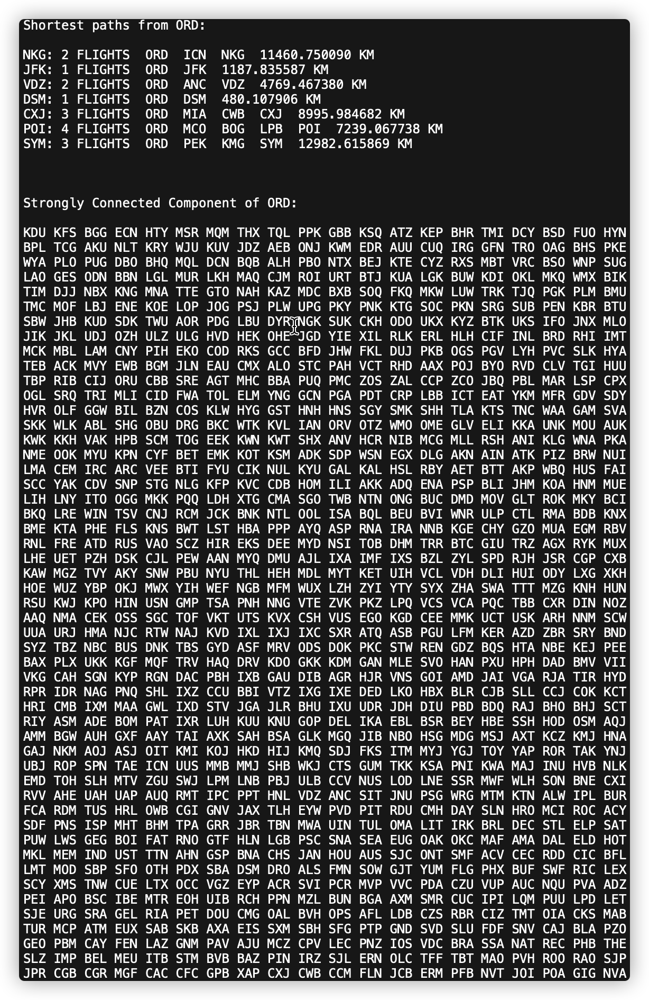

# "Open Flight" Project manual
Final Project for yujiem4-yg17-paiz3-bangyan3

## Location of Files

* The files containing the major code ("Graph.h", "Graph.cpp", "main.cpp") are in the home page of our github site.
* The files containing the data ("airports.csv", "routes.csv", "Out of Service.csv", "From to.csv") are in the "data" folder.
* The file containing the results ("Saved.txt") are in the home page as well.

## How to Run Executable

### Define Input Data

There are four data files in total.

* Two of them (airports.csv, routes.csv) contains the raw information of the airports and the routes. Both of the file names should remain **unchanged**. The contents of them can be modified, but changes **must** adopt the following rules:

  * "airports.csv":

    This file is expected to have **at least** 2 lines, where the first line is to be ignored on purpose. Each line must be separated by **exactly** 13 commas (",") **without** blank spaces around. The **fifth** position (between comma 4 and 5) represents the 3-letter code of the airport, the **seventh** position (between comma 6 and 7) represents the latitude of the airport, and the **eighth** positioin (between comma 7 and 8) represents the longitude of the airport. These three positions must contain the right information, while the other positions can be left blank, but the 13 commas must exist for each line.

  * "routes.csv":

    This file is expected to have **at least** 2 lines, where the first line is to be ignored on purpose. Each line must be separated by **exactly** 8 commas (",") **without** blank spaces around. The **third** position (between comma 2 and 3) represents the 3-letter code of the source airport, and the **fifth** position (between 4 and 5) represents the 3-letter code of the destination airport. These three positions must contain the right information, while the other positions can be left blank, but the 8 commas must exist for each line.

* The other two of them ("Out of Service.csv", "From to.csv") contains the inputs from the user. Both the file names and the content can be modified, but the changes must adopt the following rules (rules for the file names will be addressed later in the "How to Run" section):

  * "Out of Service.csv":

    The format of this file should be **exactly** the same as "airports.csv" mentioned above.

  * "From to.csv"

    This file is expected to have **at least** 2 lines, but the first line will **not** be ignored in this case. Instead, the first line is designed to represent two things: the source airport where the shortest paths start, and the pivot airport to identify the strongly connected component. The rest of the lines represent the destination airports which we want to find the shortest paths to. Each line must contain **exactly** one single 3-letter code.

### Define Output Data

The outputs of the two algorithms will always be printed out in the terminal. In addition, one can choose to write the outputs into the file "Saved.txt" in the home page. Here is an example output:




The output includes:

1. The shortest paths from the airport ORD to some other airports are printed in the upper region of the output. Each line includes:
   * the destination airport;
   * the number of flight along the shortest path;
   * the path itself as an ordered list of airports; and
   * the cumulative distance from ORD to the destination.
2. The set of airports that share the same strongly connected component with ORD is printed in the lower region of the output. It includes:
   * the set itself as an unordered list of airports; and
   * the size of the set.

### How to Run

To compile the programs, one need to type `make` in the command line. After that, to run the executable, one need to type

```shell
./main [PATH TO INPUT_1] [PATH TO INPUT_2]
```

in the command line, where the contents inside the brackets are substituted properly. Here, "INPUT_1" refers to the list of airports that are out of service, while "INPUT_2" refers to the expected source airport and the destination airports. So, by default, the command would be

```shell
./main "data/Out of Service.csv" "data/From to.csv"
```

and the program would begin to run.

If one wants to change the source of input, two rules must be followed:

1. The data must be in ".csv" format.
2. The content inside each file must meet the requirements of "Out of Service.csv" and "From to.csv", respectively.

If the two rules are followed, then one can safely change the paths to different inputs. For example, if one created two ".csv" files in the home folder, then the command

```shell
./main "other_input_1.csv" "other_input_2.csv"
```

is valid and executable.

When the program is being executed, the outputs shown above will be printed out in the terminal. Then, a prompt will be generated in the terminal saying

```shell
Do you want to save the result? (y/n)
```

If one wants to save the outputs to files, then he can press `y` to confirm the operation, and the file "Saved.txt" will be modified to contain the exact outputs. If one does not want to save the outputs to files, then he can press `n` to abort the operation, and the program will be safely exited.

## How to Run Tests

### Test Suites

The test suite is the "test.cpp" file in the "test" folder. It includes checking whether the shortest paths generated are indeed the shortest, whether the number of airports in the same strongly connected component are correct, and whether both algorithms work well after putting some airports out of service.

To reproduce the tests, one need to run the algorithms and compare the return values with the correct or expected answers.

### How to Run

To compile the tests, one need to type `make test` in the command line. Then, to run the test, one need to type `./test`. If all the test are passed, there will be a prompt like this:


