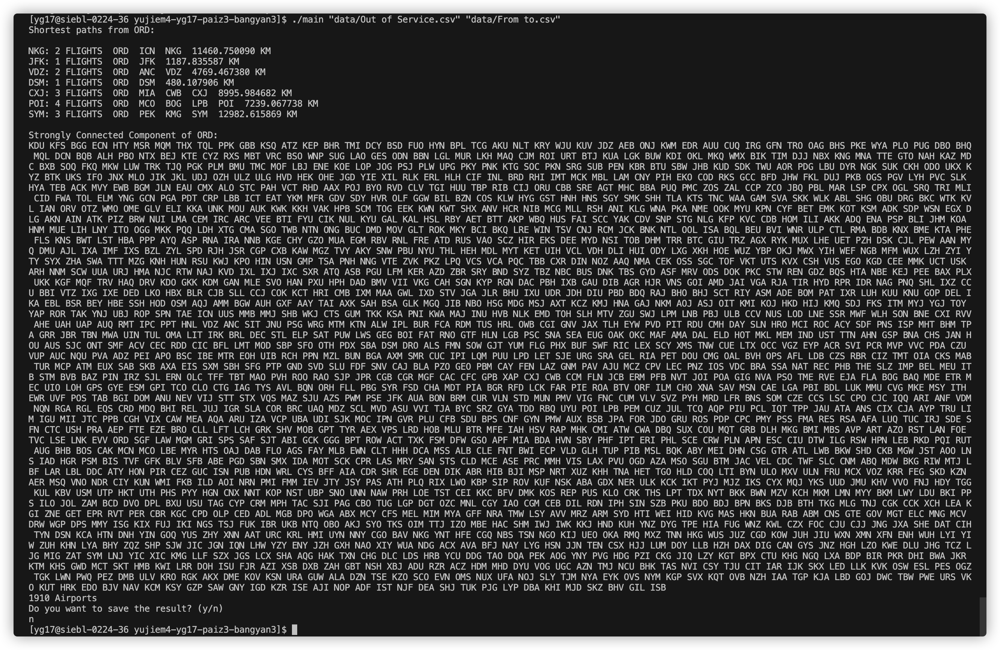

# Results

## Goals

Required projected goals are all met:

1. The shortest paths from the airport ORD to some other airports are printed in the upper region of the output. Each line includes:
   * the destination airport;
   * the number of flight along the shortest path;
   * the path itself as an ordered list of airports; and
   * the cumulative distance from ORD to the destination.
2. The set of airports that share the same strongly connected component with ORD is printed in the lower region of the output. It includes:
   * the set itself as an unordered list of airports; and
   * the size of the set.

The two goals completed above are based on four data files, which contains the data of airports, routes, desired starting airport (the set of strongly connected component also stems from this airport) and destinations, and airports that are out of service. 

## Correctedness

We argue that the algorithms works correctly based on two reasons:

1. The tests we did on the small, purposedly-chosen data sets are correct.
2. The tests after we put some airports out of service generates expected changes in the outputs.

The test suite we created includes checking whether the shortest paths generated are indeed the shortest, whether the number of airports in the same strongly connected component are correct, and whether both algorithms work well after putting some airports out of service. Details can be checked in the "tests" folder.

